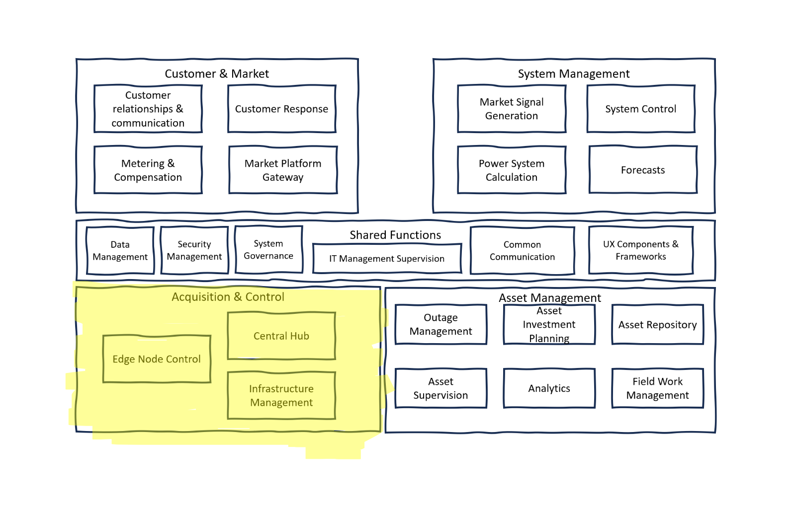

# Acquisition and Control

The Acquisition and Control section in the power system architecture focuses on the collection and management of data and the control of power system operations. This is where the physical state of the power system is monitored, decisions are made, and actions are taken to maintain system stability, efficiency, and reliability. This includes managing both less-critical and critical equipment, ensuring that all components communicate effectively, and that control actions are timely and accurate.

**Edge Node Control**: is the first line of the acquisition and control system, managing the control points at the edges of the grid, such as substations and smart meters. It handles protocol management, local automations, and ensures synchronization and balance within the power system. This involves monitoring and control of the equipment, management of frequency and storage, and overseeing power quality. It also includes the aggregation and protection of distributed or virtualized equipment, recording failures, and managing demand response and outages.

**Central Hub**: is the command center for the acquisition and control section. It oversees the protocol conversion, data acquisition, and ensures cross-device and vendor compatibility. It supports data encryption and key management to maintain the integrity and security of the control systems. The hub is essential for the centralized management of the power grid, ensuring that data from various nodes is collected, processed, and used effectively to make system-wide decisions.

**Infrastructure Management**: involves the remote supervision and administration of physical and digital power system assets. This includes managing remote equipment and nodes, configuring system settings, and handling the commissioning and installation of new assets. This component ensures that all pieces of the power system are correctly set up, maintained, and updated to respond to the grid's operational demands and to support the long-term strategic goals of the power system.        
           