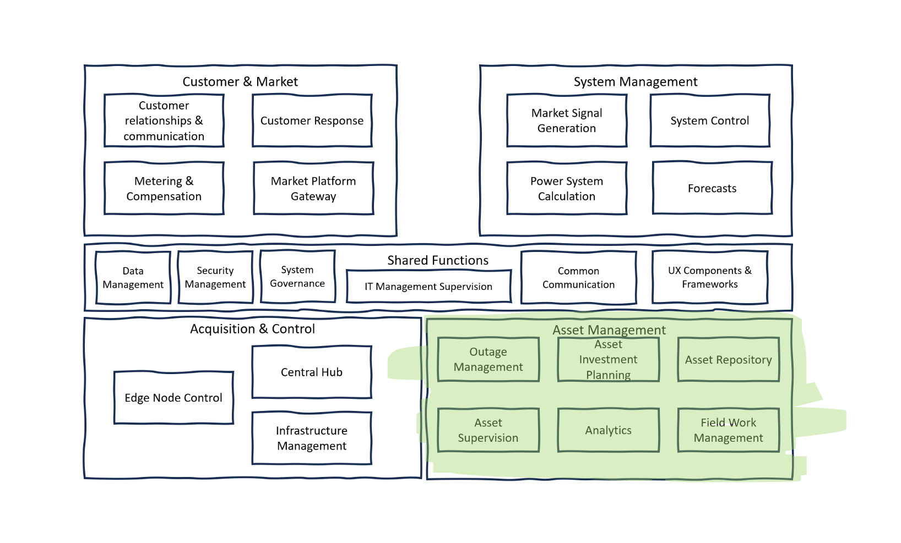

# Asset Management

Asset Management within a power system's reference architecture is a comprehensive approach that ensures all physical and digital assets operate optimally throughout their lifecycle. It spans from outage management and investment planning to supervision, analytics, and field operations. This segment of the architecture is integral to the sustainable operation of the power grid, ensuring that assets are well-maintained, efficiently utilized, and strategically enhanced or replaced over time.

 **Outage Management**: is focused on efficiently addressing power outages with a systematic approach. This includes ticketing systems for issue tracking, programming, and planning for outages, as well as assessing the impact on customers. Effective coordination and management of outages, especially distributed outages, are crucial for minimizing downtime and ensuring prompt restoration of services. This component is key to maintaining customer satisfaction and the reliability of the power supply.

**Asset Investment Planning**: ensures that investments in power system assets are made strategically. This involves managing policies for renewable energy integration, setting overarching investment policies, and handling the financial aspects of asset procurement and deployment. The goal is to align investment decisions with the long-term objectives of sustainability, reliability, and financial viability, taking into account the evolving energy landscape and regulatory environment.

**Asset Supervision**: encompasses the real-time monitoring of asset performance, including the analysis of logs and data collected from the assets. It ensures that all assets are performing as expected and identifies any issues that may require attention. This component is also responsible for the overall planning of asset utilization and lifecycle management, ensuring that each asset is used effectively and maintained properly from acquisition to retirement.

**Analytics**: in Asset Management involves the application of various data analysis techniques to enhance asset performance and predict future maintenance needs. It ranges from basic health index calculations to sophisticated predictive analytics, leveraging digital twin technology, deep learning, and simulations. These analytical processes are essential for proactive asset management, allowing for data-driven decision-making that can extend asset life and optimize performance.

**Field Work Management**: is concerned with the organization and execution of maintenance and repair operations in the field. It enforces safety rules, manages team planning and scheduling, and oversees the supply chain to ensure that field operations are conducted safely and efficiently. This component plays a crucial role in keeping the power system operational and ensuring that the workforce is productive and well-coordinated.

**Asset Repository**: serves as a centralized database for all information related to power equipment and digital infrastructure. It includes detailed records of power equipment, configuration tools, and settings, which are essential for efficient asset management. This repository allows for quick retrieval of specifications, maintenance histories, and configuration details, facilitating better decision-making and faster response times for maintenance and troubleshooting. It acts as the knowledge base for the asset management system, supporting other components by providing the necessary data for informed asset supervision, analytics, and fieldwork management.
            