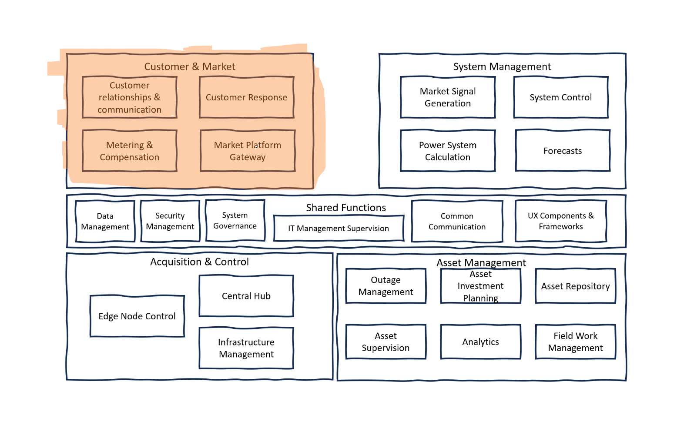

# Customer and Market

The Customer and Market section of the power system's reference architecture represents the interface between the electricity providers and their customers, as well as the market mechanisms that govern energy trading. This segment is essential for managing the complex interactions and transactions between various stakeholders, including utility companies, consumers, and market operators. It ensures that the needs and preferences of customers are met while maintaining efficient market operations. The diagram outlines the structure and flow of information, highlighting the importance of customer engagement and market facilitation in the power system.

 **Customer Relationship and Communications**: is all about the acquisition of customers, the design of systems and pricing, and the management of ongoing communications. It includes managing notifications and critical communications, especially during energy crises, which is essential for maintaining customer trust and satisfaction. The component also considers the user experience with customer applications, ensuring that interfaces are intuitive and effective. Contracts and consent management are integral parts of this component, ensuring that all engagements with the customer are legally compliant and respect privacy.

**Metering and Compensation**: focuses on the accurate measurement of energy usage and the subsequent billing and compensation. Metering is the foundation of this component, as it provides the data necessary for transparent and fair billing. Compensation and settlement mechanisms are in place to ensure that any energy fed back into the grid by customers, perhaps through renewable energy sources, is appropriately compensated. This aspect of the architecture is critical for financial fairness and accuracy in the power system.

**Customer Respons**: deals with how customers interact with and respond to the power system. It includes technologies such as smart ledgers and contracts, which facilitate dynamic and automated interactions between the customer and the service provider. This component also takes into account customer preferences, allowing for a more personalized and responsive service. This adaptability can enhance demand response programs, where customers modify their energy usage in response to real-time market signals.

**Market Platform Gateway**: serves as the interface for all market operations, including the power exchange, capacity platform, and balancing market. It's where energy trading occurs, with mechanisms for ensuring the availability of energy, managing cross-border capacity, and providing various services. This gateway is vital for the operational efficiency of the power market, facilitating transactions and ensuring that supply meets demand in both the short and long term.
            