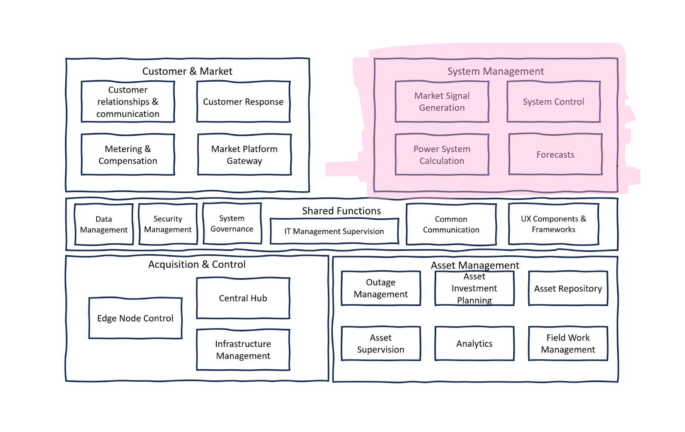

# System Management

System Management section of the power system's reference architecture integrates critical operational processes that ensure the stable and efficient functioning of the power grid. It comprises a range of activities from the generation of market signals to control mechanisms, complex calculations, and future forecasting. This comprehensive framework is designed to maintain system integrity, optimize resource distribution, and anticipate future requirements to make informed decisions for grid management and investment.

**Market Signal Generation**: is a vital part of the system management that deals with the creation of indicators that reflect the current state of energy supply and demand across different regions, including cross-border capacities. It includes assessing the sufficiency of resources to meet demand (adequacy assessment) and establishing mechanisms for balancing the grid. It also involves the organization of aggregated services that can offer collective resources or demand reduction to the grid as a single entity, enhancing the grid’s flexibility and stability.

**System Control**: component encompasses the operational aspects of the power system, such as remote operation, centralized automation, and the establishment of schedules. It ensures that all system operations are conducted efficiently and reliably. This includes maintaining power quality and system stability, as well as configuring autonomous functions to respond to system conditions. The control mechanisms in this section are critical for real-time management of the power grid.

**Power System Calculation**: is responsible for all the mathematical modeling and computational work necessary to understand and predict the behavior of the power system. It includes state estimation to provide a reliable picture of the grid's current state, as well as simulation tools for planning. Static and dynamic calculations help to understand the potential impacts of different scenarios, and dispatch/adequacy calculations ensure that the power system can meet demand. Security analysis is also a key aspect, assessing the system’s resilience to potential threats or failures.

**Forecasts**: module anticipates future system needs, such as area demands, renewable energy generation from resources like solar and wind, and the balance of local sites. It also predicts market behaviors, including international and local market prices, which are essential for strategic planning and investment. Forecasting capabilities enable the power system to adapt to upcoming trends and changes, ensuring long-term sustainability and efficiency.